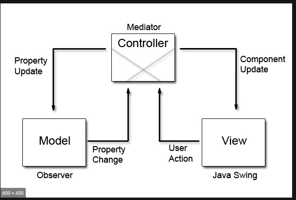

### Software Engineering Chess Project by Group-13

The erstwhile idea for the underlying architecture was an abstraction for both the CLI and GUI interfaces. It was later discovered that the GUI architecture would inflexibly be dictated by the JavaFX framework, meaning that the sort of MVC Pattern used there naturally only made sense for that type of interface. Granted, Both CLI and GUI would have essentially used the same pattern, namely MVC, however the way components communicated were still drastically different. It quickly became apparent that a universal solution would bear far too few fruits for the invested effort.

However, the original idea hadn't disappeared in its entirety, as it was then decided to make to have one common model - (essentially, but not only) the chessboard. The other aspects of the MVC-pattern were then implemented separately.

## Command Line Interface Architecture

The main idea is to have Controller be a central _mediator_ between the user, the model, and the view. The lower diagram inspired the architecture:

The **Controller** continuosly takes input from the console entered by the players(s), parses the textual input into so called **Commands**, which are executed and thereby invoke the following:
1) A series of changes in the **Model**
2) Updated **View** of the Model

For the Controller to be able to do this it is necessary for it to have bidirectional communication to both the Model and the View.

From there most of the magic happens at the Model level. The Model is a composition with a Chessboard at its heart, and many auxiliary classes, with special importance given to classes abstracting the chess pieces.

In a nutshell: the Model gets commands issued, changes accordingly, the newest state is then called by the Controller and passed to the View for display.
